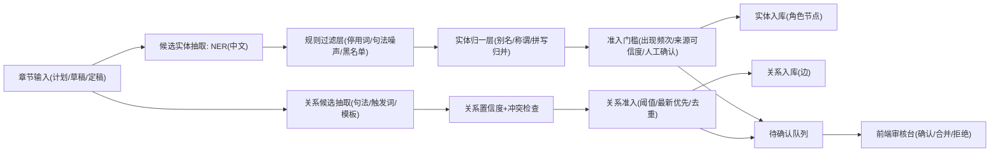

# 知识图谱“标准模式”实施方案（V1）

更新时间：2026-02-21  
作者：Codex

---

## 1. 背景与问题

当前图谱实体抽取以正则+触发词为主，已经出现多次伪角色名：

- `都市传`（来自“都市传说”）
- `都没`、`后者正`、`胡说八`、`任凭赵老板`
- `通风管`、`从管`、`冷静`

这类问题说明当前方案存在结构性缺陷：

1. 仅靠触发词（如“说/道/问”）抽取，误判不可避免。  
2. 没有实体“准入门槛”（任何命中都可入图）。  
3. 缺少统一的消歧、别名归一、人工确认闭环。  

---

## 2. 外部实践调研结论（用于本方案的依据）

> 检索日期：2026-02-21

### 2.1 实体识别应采用“统计模型 + 规则”混合

- spaCy 官方将 `EntityRuler` 定位为与统计 NER 组合使用，而非替代模型。  
  来源：[spaCy EntityRuler](https://spacy.io/api/entityruler)

### 2.2 中文 NER 需考虑分词与词汇边界噪声

- Lattice LSTM 论文指出中文实体识别受词边界/词汇信息影响显著，词汇增强可降低切分噪声。  
  来源：[Chinese NER Using Lattice LSTM](https://aclanthology.org/P18-1144/)

### 2.3 关系抽取天然高噪声，不应“强行补关系”

- DocRED 研究与后续工作反复说明：关系抽取标注不完整、噪声高，工程上应引入阈值与人工复核。  
  来源：[Re-DocRED (EMNLP 2022)](https://aclanthology.org/2022.emnlp-main.580/)

### 2.4 消歧不是可选项，应作为固定层

- spaCy 官方提供 `EntityLinker`，强调实体链接/消歧在知识图谱场景是关键步骤。  
  来源：[spaCy EntityLinker](https://spacy.io/api/entitylinker)

### 2.5 中文可用工具链（优先本地可部署）

- HanLP：提供中文 NER 组件与多任务 NLP 管线。  
  来源：[HanLP NER 文档](https://hanlp.hankcs.com/docs/annotations/ner/index.html)
- LTP：中文分词/词性/NER/句法工具链，可本地部署。  
  来源：[LTP 官方仓库](https://github.com/HIT-SCIR/ltp)
- Stanza：多语言 NER 备选（可做基准对照）。  
  来源：[Stanza NER 文档](https://stanfordnlp.github.io/stanza/ner.html)

---

## 3. 标准模式目标

### 3.1 目标

1. 图谱中的“角色实体”Precision 提升到可展示级（避免破坏观感）。  
2. 新角色只在满足准入门槛时入图。  
3. 关系边尽量“少而准”，不再默认灌入 `progress`。  
4. 支持人工确认与纠错闭环。  

### 3.2 非目标（V1 不做）

1. 不做全自动高召回（优先精准）。  
2. 不做开放域实体链接到外部百科。  
3. 不做跨项目的全局图谱融合。  

---

## 4. 总体架构（标准模式）

---

## 5. 数据抽取与准入细则

## 5.1 候选实体来源分级（Source-of-Truth 权重）

按可信度从高到低：

1. 项目设定（角色卡、主角/配角字段）  
2. 章节蓝图结构化字段（`role_goals`、冲突点角色）  
3. 已批准章节正文（approved/final）  
4. 草稿（draft，默认仅做弱证据）  

规则：低可信来源不能单独触发“入图”。

## 5.2 候选抽取（NER）

建议 V1 采用本地可部署路线：

- 主模型：HanLP 或 LTP 的中文 NER（优先 `PERSON`）  
- 兜底规则：现有 regex 只作为补充，不再直接入库

输出格式（内部）：

- `text_span`
- `entity_type`
- `start/end`
- `source`
- `chapter_id`
- `model_score`（若可得）

## 5.3 规则过滤（Hard Filter）

必须命中以下全部条件才进入下一层：

1. 类型必须是 `PERSON` 或角色白名单来源。  
2. 命中停用词/前缀黑名单则直接拒绝。  
3. 命中句法噪声模板（如“X道”“从X道”“后者X”）直接拒绝。  
4. 长度、字符集、尾字合法性校验通过。  

## 5.4 实体归一与消歧

为同一角色建立 canonical id：

- `苏小柒`、`小柒`、`苏小姐` -> `character:su_xiaoqi`
- `陆老板`、`陆仁甲` -> `character:lu_renjia`

策略：

1. 同章共现 + 高相似别名（规则）先自动合并。  
2. 风险高的合并进入人工确认队列。  
3. 所有别名映射记录可回滚。  

## 5.5 准入门槛（Admission Gate）

新角色默认 **不自动入图**，需满足以下任一：

1. 在高可信来源中出现（角色卡/蓝图字段）；  
2. 在正文中跨 `>=2` 章出现；  
3. 通过人工确认。  

关系边准入：

1. `subject/object` 均为已准入角色；  
2. 关系置信度达到阈值（例如 0.65）；  
3. 同对角色仅保留最新且最强关系（可配置是否显示历史）。  

---

## 6. 存储与接口改造建议

## 6.1 数据表（新增）

1. `entity_candidates`：候选实体池（含来源与置信度）  
2. `entity_aliases`：别名到 canonical id 的映射  
3. `entity_reviews`：人工确认记录（approve/reject/merge）  
4. `relation_candidates`：候选关系池（含证据句与评分）

## 6.2 API（新增/调整）

1. `GET /api/graph/review/candidates`：拉取待审核候选  
2. `POST /api/graph/review/approve`：确认入图  
3. `POST /api/graph/review/reject`：拒绝候选  
4. `POST /api/graph/review/merge`：实体合并  
5. `GET /api/entities/:project_id`：只返回“已准入”实体  
6. `GET /api/events/:project_id`：只返回“已准入”关系

---

## 7. 前端交互改造建议

1. 图谱页新增“待确认”入口（badge 数量）。  
2. 点击候选显示证据句（章节、段落、上下文）。  
3. 提供三按钮：`确认角色` / `拒绝` / `合并到现有角色`。  
4. 图谱默认隐藏低置信边，防止视觉污染。  

---

## 8. 质量指标与验收

## 8.1 指标

1. 实体精确率（Entity Precision）  
2. 关系精确率（Relation Precision）  
3. 伪角色率（Noise Node Rate）  
4. 审核通过率（Review Accept Rate）  
5. 用户手动修复次数（每章）  

## 8.2 验收门槛（V1）

1. 伪角色率 <= 2%  
2. 人物实体精确率 >= 95%  
3. 关系精确率 >= 85%  
4. 关键项目（长城路猪肉铺2号）中不再出现已知噪声词样例

---

## 9. 实施计划（建议 3 个迭代）

## 迭代 A（止血，1-2 天）

1. 引入候选池，不再“命中即入库”。  
2. 保留当前规则并强化黑名单/句法过滤。  
3. 接口只返回已准入实体。  

## 迭代 B（标准模式核心，3-5 天）

1. 接入 HanLP/LTP NER。  
2. 加入实体准入门槛（跨章、来源分级、人工确认）。  
3. 增加别名归一与合并流程。  

## 迭代 C（质量闭环，2-3 天）

1. 增加审核台。  
2. 加入质量看板（精确率、噪声率趋势）。  
3. 增加回归测试集（真实章节样本+对抗样本）。  

---

## 10. 风险与回退

主要风险：

1. NER 模型在小说文风下仍有误判。  
2. 角色别名过多导致过合并。  
3. 审核成本升高影响使用体验。  

回退方案：

1. 一键切回“保守模式”（仅角色卡入图）。  
2. 图谱入口可临时隐藏，仅保留角色表。  
3. 候选池不丢，待算法稳定后再批量回放入图。  

---

## 11. 是否需要“删掉这块”

如果你坚持“对外展示不能有明显瑕疵”，建议：

1. 在标准模式完成前，图谱默认切到“仅已确认角色”视图；  
2. 若仍不达标，临时下线关系图，仅保留“角色列表 + 关系表格（审核通过）”；  
3. 达到验收门槛后再恢复完整图谱。

这比彻底删除功能更稳：保留数据资产与后续升级空间。

---

## 12. 立即可执行清单（本仓库）

1. 增加 `graph_mode` 配置：`conservative | standard`  
2. 新建 `entity_candidates`/`relation_candidates` 表  
3. 改 `upsert_graph_from_chapter`：改为“写候选池 + 准入判断”  
4. 新增审核 API  
5. 前端新增“候选审核”侧栏  
6. 加入回归样本（含 `都市传`、`都没`、`后者正`、`胡说八`、`任凭赵老板`、`通风管`、`从管`、`冷静`）  

