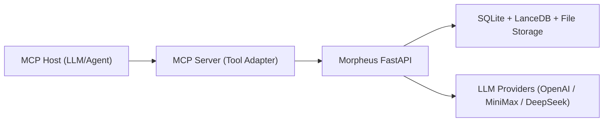

# Morpheus MCP 服务适配方案（详细版）

## 1. 结论与现状

Morpheus 当前已经具备“脱离前端独立运行”的基础，MCP 适配可行，且建议采用**薄适配层**（MCP Server 代理现有 FastAPI）。

- 后端是完整业务入口：`/Volumes/Work/Projects/Morpheus/backend/api/main.py:91`
- 前端仅通过 `/api` 调后端：`/Volumes/Work/Projects/Morpheus/frontend/src/lib/api.ts:4`
- 流式交互是标准 SSE：`/Volumes/Work/Projects/Morpheus/frontend/src/hooks/useSSEStream.ts:272`
- 后端可直接脚本启动：`/Volumes/Work/Projects/Morpheus/backend/scripts/run_api.sh:18`
- 后端 E2E 流程测试存在且可直接验证：`/Volumes/Work/Projects/Morpheus/backend/tests/test_api_smoke.py:69`
- LLM 具备无 key 离线回退：`/Volumes/Work/Projects/Morpheus/backend/core/llm_client.py:136`

已验证命令（在 `backend` 目录）：
`../backend/venv/bin/python -m pytest -q tests/test_api_smoke.py::NovelistApiSmokeTest::test_end_to_end_generation_flow`
结果：`1 passed in 0.28s`

---

## 2. MCP 服务目标

通过 MCP 暴露 Morpheus 的“可编排能力”，让任意支持 MCP 的宿主（IDE、Agent 平台、其他 LLM 编排器）可以直接调用：

- 项目创建/查询/删除
- 章节规划与生成
- 一致性检查与审阅
- 记忆检索与提交
- 图谱/指标/运行时状态
- 导出作品

---

## 3. 推荐架构（薄适配）

设计原则：

- MCP Server 不重写业务逻辑，只做协议转换、参数校验、错误归一化。
- 优先复用现有 REST，流式能力分阶段接入。
- 所有工具调用可回溯到具体 API endpoint。

---

## 4. MCP 工具清单（建议）

## 4.1 基础与运行时

| MCP Tool | Backend API | 说明 |
|---|---|---|
| `health_check` | `GET /api/health` | 服务健康 |
| `get_runtime_llm` | `GET /api/runtime/llm` | 当前 LLM provider/model/可用性 |
| `list_story_templates` | `GET /api/story-templates` | 可用故事模板 |

## 4.2 项目管理

| MCP Tool | Backend API | 说明 |
|---|---|---|
| `create_project` | `POST /api/projects` | 创建项目 |
| `list_projects` | `GET /api/projects` | 项目列表 |
| `get_project` | `GET /api/projects/{project_id}` | 项目详情 |
| `delete_project` | `DELETE /api/projects/{project_id}` | 删除项目 |
| `batch_delete_projects` | `DELETE /api/projects` | 批量删除 |
| `export_project` | `GET /api/projects/{project_id}/export` | 导出 zip |
| `projects_health` | `GET /api/projects/health` | 项目健康检查 |
| `repair_projects_health` | `POST /api/projects/health/repair` | 修复项目存储问题 |

## 4.3 章节与生成

| MCP Tool | Backend API | 说明 |
|---|---|---|
| `create_chapter` | `POST /api/chapters` | 新建章节 |
| `get_chapter` | `GET /api/chapters/{chapter_id}` | 查询章节 |
| `list_chapters` | `GET /api/projects/{project_id}/chapters` | 项目章节列表 |
| `delete_chapter` | `DELETE /api/chapters/{chapter_id}` | 删除章节 |
| `generate_plan` | `POST /api/chapters/{chapter_id}/plan` | 生成蓝图 |
| `generate_draft` | `POST /api/chapters/{chapter_id}/draft` | 生成草稿 |
| `generate_one_shot_chapter` | `POST /api/chapters/{chapter_id}/one-shot` | 一句话整篇 |
| `generate_one_shot_book` | `POST /api/projects/{project_id}/one-shot-book` | 整卷/整本生成 |
| `stream_draft` | `GET /api/chapters/{chapter_id}/draft/stream` | 单章 SSE 输出 |
| `stream_one_shot_book` | `POST /api/projects/{project_id}/one-shot-book/stream` | 多章 SSE 输出 |
| `update_draft` | `PUT /api/chapters/{chapter_id}/draft` | 手动改稿后复检 |

## 4.4 记忆/图谱/审阅/指标

| MCP Tool | Backend API | 说明 |
|---|---|---|
| `memory_query` | `GET /api/memory/query` | 混合检索（FTS+向量） |
| `memory_commit` | `POST /api/memory/commit` | 将 final 写入三层记忆 |
| `get_memory_source` | `GET /api/projects/{project_id}/memory/source` | 获取记忆源 Markdown |
| `check_consistency` | `POST /api/consistency/check` | 一致性检测 |
| `review_chapter` | `POST /api/review` | approve/reject/rewrite/exempt |
| `get_trace` | `GET /api/trace/{chapter_id}` | 决策轨迹回放 |
| `get_entities` | `GET /api/entities/{project_id}` | 实体图谱 |
| `get_events` | `GET /api/events/{project_id}` | 事件图谱 |
| `get_identity` | `GET /api/identity/{project_id}` | 世界观/身份层 |
| `update_identity` | `PUT /api/identity/{project_id}` | 更新 identity |
| `get_metrics` | `GET /api/metrics` | 质量与性能指标 |

---

## 5. 流式能力在 MCP 的接入策略

建议分两档：

- **V1（快速落地）**
  仅暴露非流式工具：`generate_one_shot_book`、`generate_draft`。返回最终结果，最稳。
- **V2（增强）**
  封装 SSE：
  `start_generation`（创建任务）
  `poll_generation_events`（增量事件拉取）
  `cancel_generation`（任务取消）

这样可以避免 MCP 宿主对长连接/事件流支持不一致的问题。

---

## 6. 风险与控制

| 风险 | 级别 | 说明 | 建议 |
|---|---|---|---|
| 并发写同一项目 | 中 | 内存缓存+磁盘状态并存 | MCP 层按 `project_id` 加互斥锁 |
| 长任务超时 | 中 | 生成耗时长 | 工具超时策略 + 后台任务化 |
| 鉴权缺失 | 高 | 当前 API 未内建鉴权 | MCP Server 增 API Token/JWT |
| 多 worker 状态一致性 | 中 | 多进程缓存天然分离 | 关键路径以磁盘/DB 为准，减少内存强依赖 |
| 流式协议差异 | 中 | 宿主侧实现不统一 | V1 先非流式，V2 再事件化 |

---

## 7. 适配工作量评估

- PoC（10~15 个核心工具，非流式优先）：**1-2 天**
- 稳定版（错误映射、重试、并发锁、观测）：**3-5 天**
- 生产版（鉴权、限流、契约测试、任务队列）：**1-2 周**

---

## 8. 你通过 MCP 能直接使用的功能（总结）

你可以把 Morpheus 当作一个“可调用写作引擎”，通过 MCP 直接做：

- 新建/管理小说项目与模板
- 批量创建章节和章节规划
- 单章/整卷/整本自动生成
- 生成后的一致性检测与审阅流转
- 记忆检索与记忆提交（长期连载保持上下文）
- 查看 Agent 决策轨迹（trace replay）
- 查看实体关系与事件图谱
- 调整世界观 Identity 与禁忌约束
- 拉取质量指标与运行时状态
- 导出项目成品（zip）
